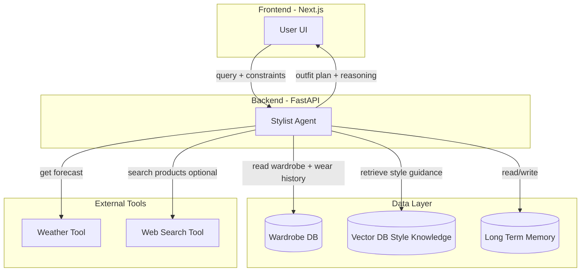

# Stylepal Build Plan

## Architecture Overview



---

## Phase 1: Project Scaffolding

**Goal:** Establish monorepo structure with Next.js frontend and FastAPI backend.

- **1.1 Monorepo layout**
  - `stylepal/`
    - `frontend/` — Next.js 14+ (App Router)
    - `backend/` — FastAPI
    - `shared/` — shared types (optional, or duplicate minimal types)
    - Root `README.md`, `.gitignore`, `.env.example`
- **1.2 Next.js frontend**
  - `npx create-next-app@latest frontend` with TypeScript, Tailwind, App Router
  - Add **shadcn/ui** (`npx shadcn@latest init`) — [ui.shadcn.com](https://ui.shadcn.com)
  - Configure for Vercel (default)
  - Add `NEXT_PUBLIC_API_URL` for backend
- **1.3 FastAPI backend**
  - `backend/` with `main.py`, `requirements.txt`
  - CORS for frontend origin
  - Health check endpoint (`/health`)
  - Structure: `routers/`, `services/`, `models/`, `core/`
- **1.4 Local development**
  - `backend/`: `uvicorn main:app --reload`
  - `frontend/`: `npm run dev`
  - Optional: `docker-compose.yml` for DBs later

---

## Phase 2: Data Models and Persistence

**Goal:** Define schemas and set up databases for wardrobe, style knowledge, and long-term memory.

- **2.1 Wardrobe database (SQLite for MVP, PostgreSQL later)**
  - **Items:** id, name, category (top/bottom/outerwear/shoes/accessories), subcategory, color, pattern, material, occasion_tags (JSON), season_tags, created_at
  - **Wear history:** item_id, worn_at, occasion, outfit_id (nullable)
  - Use SQLAlchemy + Alembic for migrations
- **2.2 Vector database for style knowledge**
  - Use **Qdrant Cloud** for RAG
  - Seed with curated professional styling principles (fit, color, silhouette, occasion appropriateness)
  - Embeddings via Gemini Embedding API
- **2.3 Long-term memory (JSON files for MVP; Document DB Later)**
  - **User profile:** silhouette_preferences, comfort_thresholds, rotation_patterns (JSON)
  - **Outfit history:** outfit_id, items (JSON), occasion, rating, confidence_signal, created_at
  - **Preferences:** learned from ratings and feedback

---

## Phase 3: Core API Layer

**Goal:** REST endpoints for wardrobe and profile management.

- **3.1 Wardrobe API**
  - `GET /wardrobe/items` — list with filters (category, occasion, season)
  - `POST /wardrobe/items` — add item
  - `GET /wardrobe/items/{id}` — get item + wear history
  - `PATCH /wardrobe/items/{id}` — update
  - `DELETE /wardrobe/items/{id}` — delete
  - `GET /wardrobe/wear-history` — wear frequency analytics
- **3.2 Profile and memory API**
  - `GET /profile` — user profile + preferences
  - `PATCH /profile` — update preferences
  - `POST /outfits` — record outfit selection
  - `POST /outfits/{id}/rate` — record rating/feedback

---

## Phase 4: Stylist Agent (Gemini)

**Goal:** LLM-powered agent that orchestrates tools and returns outfit plans with reasoning.

- **4.1 Gemini integration**
  - Use `google-generativeai` Python SDK
  - System prompt defining Stylist Agent persona: maximize reuse, professional styling, respect constraints
- **4.2 Tool definitions (function calling)**
  - **Wardrobe tool:** read items + wear history (calls Phase 3 APIs internally)
  - **Style knowledge tool:** RAG retrieval from vector DB
  - **Weather tool:** Open-Meteo or similar free API
  - **Web search tool:** optional product search (e.g., Serper, Tavily, or Google Custom Search)
- **4.3 Agent orchestration**
  - Receive `query + constraints` from frontend
  - Call tools in sequence based on need (e.g., weather first, then wardrobe + style knowledge)
  - Return structured `outfit_plan` (item IDs, reasoning, optional product suggestions)
- **4.4 Endpoint**
  - `POST /stylist/plan` — body: `{ query, constraints?, location? }` → `{ outfit_plan, reasoning }`

---

## Phase 5: Style Knowledge Base

**Goal:** Curated RAG content for professional styling.

- **5.1 Content**
  - Documents on: fit rules, color coordination, silhouette by body type, occasion dress codes, seasonal layering, capsule wardrobe principles
  - Store as markdown/text, chunk and embed
- **5.2 Retrieval**
  - On each plan request, retrieve top-k relevant chunks
  - Inject into Gemini context as "style guidance"

---

## Phase 6: Frontend UI

**Goal:** User interface for querying the Stylist Agent and managing wardrobe.

- **6.0 UI component library**
  - Use **shadcn/ui** for primitives: Button, Input, Card, Dialog, Select, Badge, Tabs, Form, etc.
  - Add components as needed: `npx shadcn@latest add button card input dialog select badge tabs form`
  - Components live in `frontend/components/ui/` (copy-paste, not npm dependency)
- **6.1 Core pages**
  - **Home / Chat:** Input for query + constraints (e.g., "business trip tomorrow", "must wear blue blazer")
  - **Outfit result:** Display outfit plan, items, reasoning
  - **Wardrobe:** List/add/edit/delete items, view wear history
  - **Profile:** View/edit preferences (future: learned from ratings)
- **6.2 Key components**
  - Chat-style input with constraint chips (Input, Button, Badge)
  - Outfit card (Card, Badge)
  - Wardrobe item form (Form, Input, Select, Dialog for add/edit)
  - Item grid with filters (Card grid, Select/Badge filters)
- **6.3 API client**
  - Fetch/axios wrapper for backend
  - Typed requests/responses (shared types or generated)

---

## Phase 7: Learning and Personalization Loop

**Goal:** Record outfits and ratings to refine preferences over time.

- **7.1 Outfit recording**
  - When user accepts a plan, `POST /outfits` with items + occasion
  - Link to wear history for each item
- **7.2 Rating flow**
  - After wear: "How did this outfit work?" (1–5 or thumbs)
  - `POST /outfits/{id}/rate` stores rating + optional notes
- **7.3 Preference refinement (later)**
  - Periodic job or on-demand: aggregate ratings, update profile preferences
  - Use in Stylist Agent context: "User prefers X, avoids Y"

---

## Phase 8: Deployment

**Goal:** Production deployment with Vercel for frontend.

- **8.1 Frontend (Vercel)**
  - Connect repo, set `NEXT_PUBLIC_API_URL` to backend URL
  - Vercel handles Next.js build and hosting
- **8.2 Backend**
  - Vercel does not run long-lived FastAPI processes
  - Deploy to **Railway**, **Render**, or **Fly.io**
  - Use PostgreSQL (e.g., Supabase, Neon) and replace SQLite
  - Use hosted vector DB (Qdrant Cloud, Pinecone, Supabase pgvector) if needed
- **8.3 Environment**
  - `GEMINI_API_KEY`, `DATABASE_URL`, `QDRANT_URL`, `QDRANT_API_KEY`, `OPEN_METEO_URL` (or similar), optional search API key

---

## Suggested File Structure

```
stylepal/
├── frontend/
│   ├── app/
│   │   ├── page.tsx          # Home / chat
│   │   ├── wardrobe/
│   │   ├── profile/
│   │   └── layout.tsx
│   ├── components/
│   └── lib/
├── backend/
│   ├── main.py
│   ├── routers/
│   │   ├── wardrobe.py
│   │   ├── profile.py
│   │   └── stylist.py
│   ├── services/
│   │   ├── agent.py
│   │   ├── wardrobe.py
│   │   ├── rag.py
│   │   └── tools/
│   ├── models/
│   └── core/
├── docs/
│   └── BUILD_PLAN.md
├── .env.example
└── README.md
```

---

## Dependencies Summary

| Layer     | Key Dependencies                                            |
| --------- | ----------------------------------------------------------- |
| Frontend  | Next.js, Tailwind, TypeScript, shadcn/ui (Radix + Tailwind) |
| Backend   | FastAPI, SQLAlchemy, Alembic, google-generativeai, httpx    |
| Vector DB | Qdrant Cloud (qdrant-client)                                 |
| Tools     | Open-Meteo (weather), Serper/Tavily (search, optional)      |

---

## MVP Scope (Phases 1–6)

For a first working version, focus on Phases 1–6: scaffolding, data layer, API, Stylist Agent with Gemini and tools, and frontend. Phase 7 (learning loop) and Phase 8 (deployment) can follow once the core flow works.
