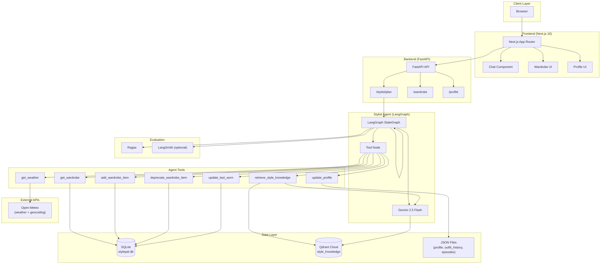
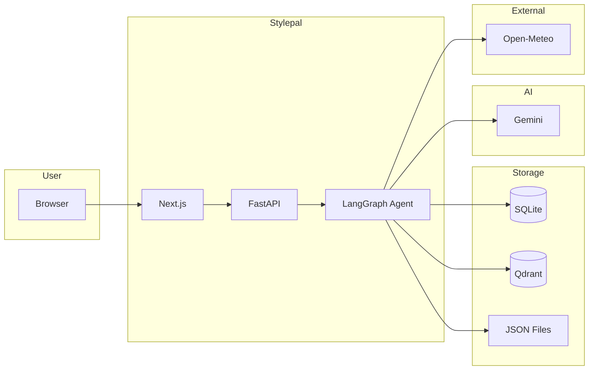

# Stylepal Infrastructure Diagram

## Stack Overview

## Simplified Architecture

## Tooling Choices & Rationale

| Component | Choice | Why |
|-----------|--------|-----|
| **Next.js 16** | React framework with App Router | Server components, fast routing, and strong ecosystem for production apps. |
| **shadcn/ui + Radix** | Component library | Accessible, customizable primitives without heavy styling overhead. |
| **Tailwind CSS** | Utility-first CSS | Fast iteration and consistent design tokens without custom CSS. |
| **FastAPI** | Python API framework | Async support, automatic OpenAPI docs, and strong typing for the agent backend. |
| **Uvicorn** | ASGI server | Fast async Python server that fits FastAPI deployments. |
| **SQLite + SQLAlchemy** | Primary database | Zero-config, file-based storage for wardrobe and wear history; easy local dev. |
| **Qdrant Cloud** | Vector database | Managed vector storage for semantic search over style knowledge; 768-dim Gemini embeddings. |
| **Gemini 2.5 Flash** | LLM + embeddings | Single model for chat and embeddings; fast and cost-effective for agent + RAG. |
| **LangGraph** | Agent orchestration | Stateful graph with tool loops; supports multi-turn and memory. |
| **LangChain** | LangChain core | Integrations for tools, prompts, and message handling for the agent. |
| **Open-Meteo** | Weather API | Free, no API key; supports geocoding and date resolution for outfit planning. |
| **JSON files** | Profile & memory | Simple file-based storage for profile, outfit history, and episodes without extra DB. |
| **Ragas** | Evaluation | LLM-based metrics for RAG and agent; supports faithfulness, recall, tool call accuracy. |
| **LangSmith** | Tracing | Optional observability for debugging agent runs and tool calls. |
