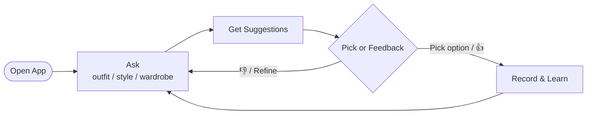
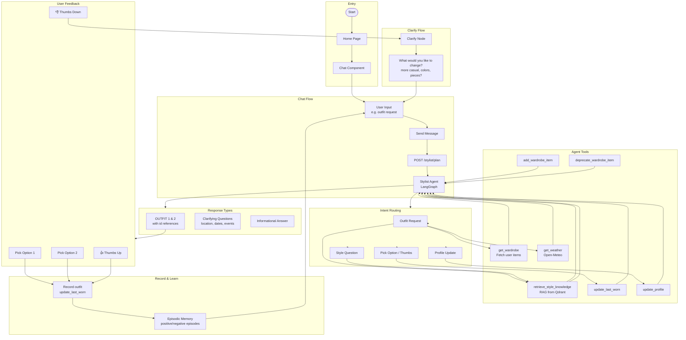
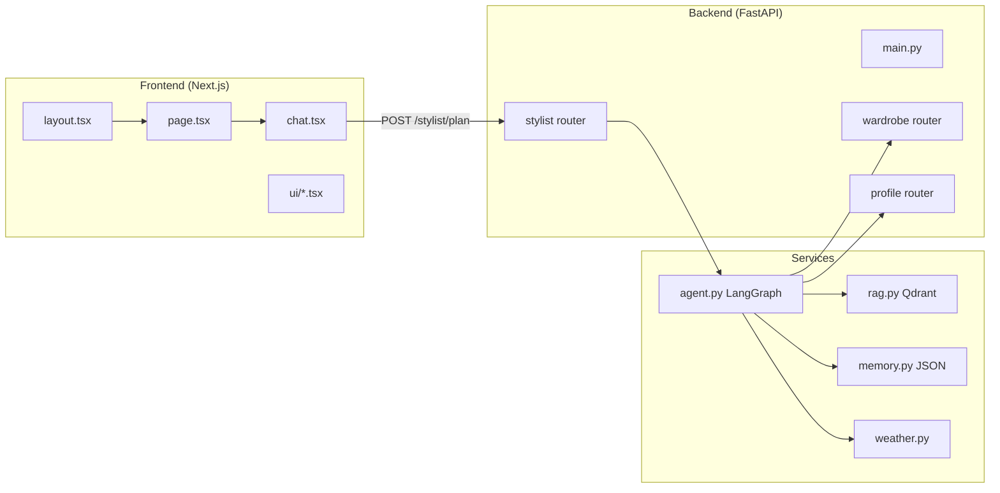

# StylePal User Flow

User flows and architecture for the StylePal wardrobe intelligence app.

## High-Level User Flow

## Main User Flow

## Simplified App Architecture

## Key Interactions

| Interaction | Flow |
|-------------|------|
| **Outfit request** | User asks (e.g. "Outfit for client meeting tomorrow") → Agent calls `get_wardrobe`, `retrieve_style_knowledge`, `get_weather` → Returns OUTFIT 1 and OUTFIT 2 with `[id=X]` references |
| **Pick option** | User clicks "Pick Option 1" or "Pick Option 2" → Agent calls `update_last_worn` → Brief confirmation |
| **Thumbs up** | User clicks 👍 → `update_last_worn` if outfit was suggested, else acknowledgment → Episodic memory records positive outcome |
| **Thumbs down** | User clicks 👎 → Clarify node asks "What would you like to change?" |
| **Profile update** | User says "I prefer tailored fits" / "I'm pear-shaped" → Agent calls `update_profile` |
| **Add item** | User says "I bought a navy blazer" → Agent calls `add_wardrobe_item` |
| **Remove item** | User requests removal → Agent shows matching items with ids → User confirms → Agent calls `deprecate_wardrobe_item` |
| **Clarifying questions** | For vague or multi-day requests, agent asks about location, dates, event types, dress codes before suggesting outfits |

## Related Docs

- [Infrastructure Diagram](./infrastructure-diagram.md) — stack overview and tooling
- [Build Plan](./BUILD_PLAN.md) — roadmap and planned features
